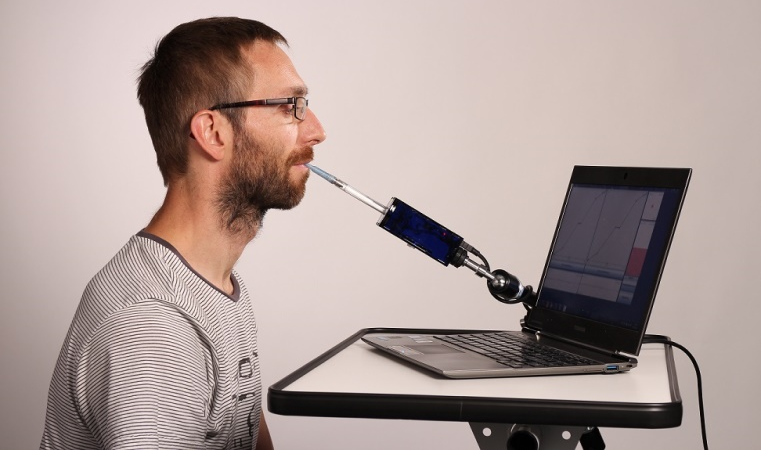
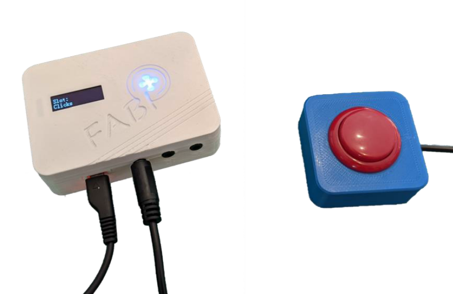
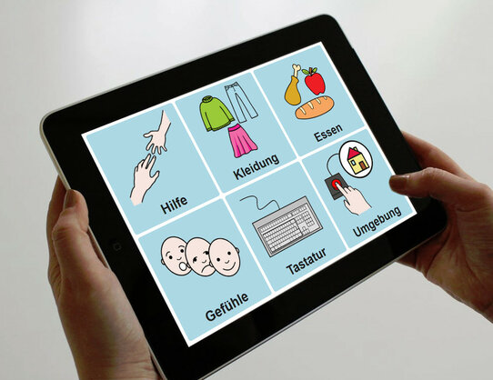

# Assistive Technologies Basics

::: slot information

Assistive Technologies allow people with disabilities to overcome mental or physical barriers and to participate in the modern society. Digital technology offers a huge potential for the inclusion of people with disablities, but poor design of digital products and services can also create new barriers.

In this module, you will learn about different forms of disability and their cause, and you will acquire knowledge about various kinds of Assistive Technology Devices. Furthermore, fundamental concepts of accessible design, usability and human computer interaction will be presented and discussed.
Finally, you will get hands-on experience with some selected Assistive Technologies like mouse and keyboard alternatives using a webcam and a microcontroller.

:::

## Overview

### Contents

- Anatomical and Physiological Background of Disability
- Types of Disabilities
- Causes and characteristics of motor, visual, auditory and cognitive disabilities
- Types of Assistive Technologies per disability, e.g. screen reader, key-based input devices
- Basics of Alternative and Augmentative Communication (AAC)
- Basics in Digital Accessibility
- Basics in Human Computer Interaction (HCI), Usability and User Interface Design
- Principles of Design for All
- Use of the [Assistive Technology Integration and Construction Set (AsTeRICS)](https://www.asterics.eu/)
- Use of [Arduino IDE](https://www.arduino.cc/en/Main/software) and introduction to the Assistive Technologies [FLipMouse](https://www.asterics-foundation.org/projects/the-flipmouse/) and [FABI](https://www.asterics-foundation.org/projects/fabi/)

::: image-triplet

:::

### Outcomes

Upon completion of the course, students will be able to

- identify and classify different types of disabilities
- know the anatomical and physiological reasons for a disability and the resulting impairments
- know the current technical aids to support people with disabilities and to be able to select suitable technologies for certain applications
- Knowing the accessibility requirements for digital documents and websites and being able to check documents for - essibility
- Understand the terms "HCI", "Usability" and "UX" and their definitions
- have information on the user centered design process and the associated standardization and to be able to apply it 
- identify use cases for the tools AsTeRICS, FABI and FLipMouse.

### Methods

The course is divided in self-study units and practical session at the UAS Technikum Wien on-site. The practical sessions won't be accessible for virtual students but they are not relevant for the grading.

| Type        | Effort \[h\] |
| :---------- | :----------- |
| Independent | 50           |
| Practical   | 25           |

## Assessment

<!-- Describe Assessment procedure verbally -->
There will be 4 assignments individually or in group works and a final exam (multiple choice test).

#### Example Assignment

<!-- Describe an example assignment definition -->
Analyze a given use case (person with disability) in terms of anatomy, physiology, pathology, applicable laws, standards and suitable Assistive Technologies.

#### Final Exam

<!-- The final exam will be ... -->
There will be a multiple choice test reflecting all areas of the course contents.

### Methods

| Type          | Points/Percent |
| :------------ | :------------- |
| Assignments   | 80%            |
| Exam          | 20%            |

### Criteria

| Grade | Grade (letter) | Scale            |
| :---- | :------------- | :--------------- |
| 5     | Nicht Genügend | < 50 points      |
| 4     | Genügend       | 50 to 62 points  |
| 3     | Befriedigend   | 63 to 74 points  |
| 2     | Gut            | 75 to 87 points  |
| 1     | Sehr gut       | 88 to 100 points |

## Requirements

### Skills

- No prior skills

### Equipment

- Computer
- Webcam
- optional: [Arduino Uno or similar microcontroller](https://www.arduino.cc/en/Main/Products)

If you don't have the hardware at home ask your lab assistent at the home university or write to [studyathome@technikum-wien.at](mailto:studyathome@technikum-wien.at)
